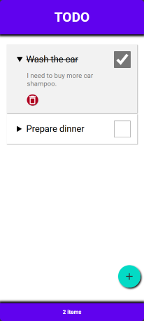
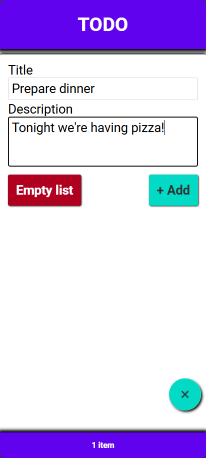
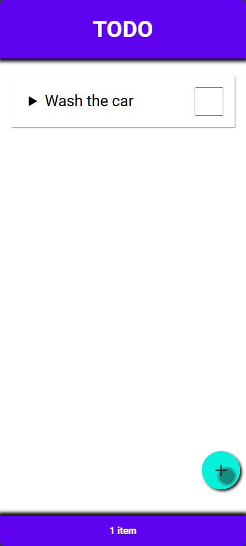

# A simple todo app built using Typescript and React.

## Built with components and utilizing useEffect React hook to save the array of tasks to local storage when tasks are added, checked or deleted.

  
<strong>[Click here to test the app!](https://fredande-todo.netlify.app/)

Expand to see an animated gif of the app

